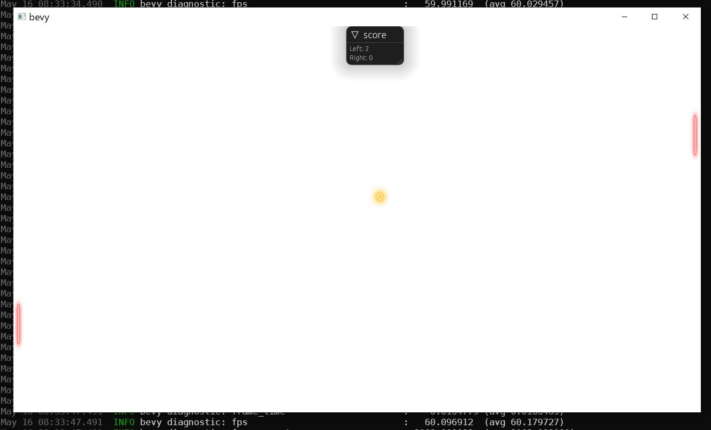

# Pong in Bevy

A simple [Pong](https://en.wikipedia.org/wiki/Pong) implementation with the [Bevy Game Engine](https://github.com/bevyengine/bevy).



# Compile

```rust
cargo build --release
```

# How to play

Left Paddle:

* W: move up
* S: move down
* Q: manual/auto mode

Right Paddle:

* Up Arrow: move up
* Down Arrow: move down
* P: manual/auto mode

# License
MIT

# Assets used

* `ping.mp3` Author: [unfa](https://freesound.org/people/unfa/sounds/215415/), License: [CC0 1.0](https://creativecommons.org/publicdomain/zero/1.0/)
* `click.mp3` Author: [Leszek_Szary](https://freesound.org/people/Leszek_Szary/sounds/146718/), License: [CC0 1.0](https://creativecommons.org/publicdomain/zero/1.0/)
* `ball.png`, `paddle1.png` Author: [Nicolás A. Ortega](https://opengameart.org/content/pong-graphics), License: [CC-BY-SA](https://creativecommons.org/licenses/by-sa/3.0/)
* `font.ttf` Author: [Google](https://fonts.google.com/specimen/Noto+Sans+JP), License: [Open Font License](https://scripts.sil.org/cms/scripts/page.php?site_id=nrsi&id=OFL)
